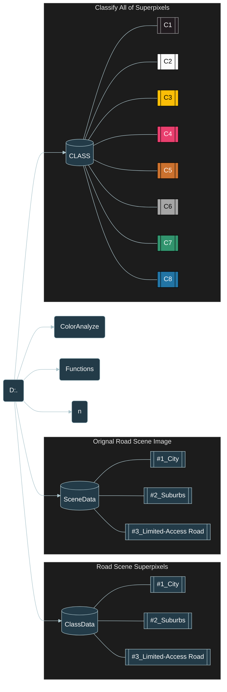
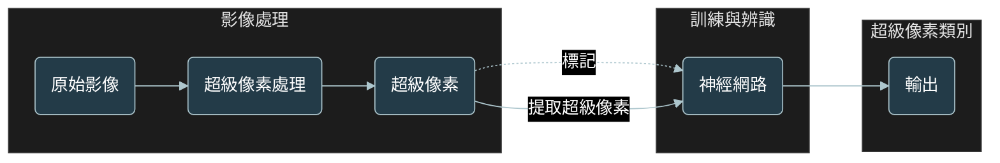
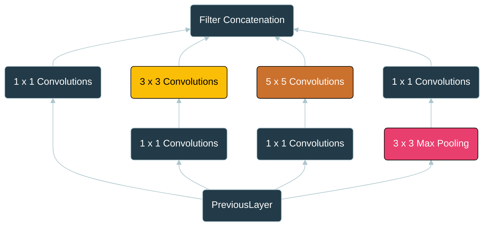
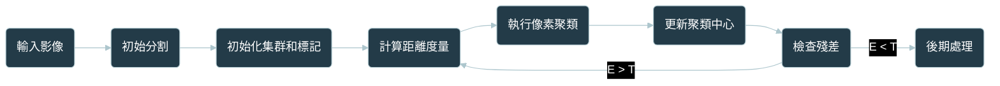

# Folder
- SceneData    : 場景影像
- n            : 切割區塊暫存區
- ClassData    : 每一張影像的超級像素區塊分類結果
- ColorAnalyze : 色彩分析參數
- Functions    : 引用方法
- Class        : 訓練用總資料集
## 資料結構

---

# Code
- P0_SuperPixelTest               : 建立單張超級像素分割影像
- P1_1_SuperPixel                 : 分割超級像素+創建資料夾
- P1_2_imageClassSeg              : 超級像素人工標記結果展示+人工標記結果區域檢測
- P2_1_imageClass                 : 影像色彩計算
- P2_2_PlotColor                  : 繪製P2_1_imageClass計算結果
- Train_Network                   : 訓練超級像素 (Train Deep Learning Network to Classify New Images)
- P3_0_countYPred                 : 計算測試集的混淆矩陣
- P3_1_Use                        : 預測超級像素類別
- P3_2_ClassCount                 : 計算超級像素分類預測數量
- P3_3_ClassCountwithConfusionmat : 使用混淆矩陣

---

# 研究系統架構
## Flow Chart

# GoogleNet
## Inception Module

#SLIC

